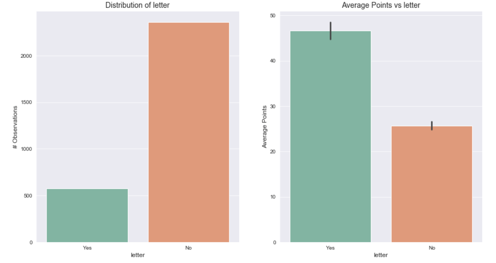

# NHL Player Point Prediction: Project Overview

- Optimised a regression model which predicts how many points an NHL player can be expected to achieve next year (RMSE of ~6.7 and r2 of 91%) which can hopefully help me (and others) find success in fantasy hockey.
- Used the official NHL API to create a custom function that collects data on every complete NHL season from 2008 through 2018.
- Visualised the data and engineered features from the scraped data that were used to improve model performance.
- Built transformation pipelines to take incoming data and convert it to a structure which could be easily ingested by my final model.
- Trained and tuned the following models: Linear, Lasso, Support Vector Machine, Decision Tree, Random Forest, Voting Regressor.

## Framing The Problem

### Data Collection

I created a custom function using the official NHL API to collect the data for this project. I chose to scrape the data for each season between 2008 and 2018, excluding the lockout year of 2012. This is due to the fact that since the game has changed so much even in the past 10 years, any data further back beyond that I was worried might skew some of our predictions. The features that I ended up extracting via the API were:
[season, team, name, birthday, age, nationality, height, weight, number, rookie, position_code, position_type, captain, alternate_capt, handedness, toi, pp_toi, sh_toi, ev_toi, assists, goals, pim, shots, shot_perc, games, hits, blocked, plusminus, shifts, points].

## Data Cleaning & Engineering

After scraping the data I needed to clean it up in various ways. The modifications I made to the data were:

- Calculated the players *age at the start of each season*. Since the *age* feature I scraped was the players current age (at time of scraping).
- Transformed the *height* variable from *FT'IN"* to just *Inches* which made it readily available to be passed into the machine learning model.
- Parsed all of the *time on ice (TOI)* features to represent *Seconds* on the ice, as opposed to *MM:SS*. 
- Combined the *captain* & *alternate_captain* features into one feature which represented whether or not the player had either of these letters on their sweater.
- Used a custom built dictionary to map each team to their respective *division* and *conference*.
- Parsed each players *birthday* and created a feature for their *birth_month* as well as *birth_season*

## Data Visualisation

I explored the distrubutions of various features in our data, and tried to uncover some relationships between any independent variables and our target variable, *points*.

Some interesting things I found during this step were:
- Players born in the Summer and Fall months tended to have more points per season on average compared to players born in the Spring or Winter months.
- Players size in the NHL is very normally distributed; meaning most players are roughly around the same size.
- The strongest correlations with our target variable were *shots* and *powerplay time on ice* which both make a lot of sense.
- Players with a letter (C or A) on their jersey tend to perform better than players without.
- Right handed players have more points on average than their left handed counterparts.

## Model Building

I first split the data into a train set and a test set. For this project I decided to test my models on the last full season of data I had (2018-2019 season) and see if I could use all the seasons prior to that to predict the top performers for that most recent season. So for that reason I held out the 2018/19 data as my testing set, and used all other seasons as the training data. 

I created a transformation pipeline using Scikit-learn transformers to encode my categorical variables, as well as added in some of my own custom transformers to take care of some of the feature engineering that I did. This made predicting new data easier as it ensured every piece of new data that came in was processed and transformed the exact same way.

The models I used were:
- **Multiple Linear Regression** as a baseline for model performance.
- **Lasso Regression** as since some of the features were a bit skewed, I thought a normalised model would perform well.
- **Support Vector, Decision Tree & Random Forest** models for the same reason as the Lasso. Also generally these are more powerful models and tend to perform well.
- **Voting Regressor** which used soft voting based on all of the previously listed models to arrive at a final prediction.

## Model Performance

The final performance on each of my tuned models was:
- Linear Regression: RMSE of 6.59
- Lasso Regression: RMSE of 6.58
- Support Vector Machine: RMSE of 5.56
- Random Forest: RMSE of 5.92
- Voting Regressor: RMSE of 5.7

Another test I did for my final model was to predict the top 20 performers for the 2018/19 season and compare my list to the actual top 20 performers for the same season. The results are below, and I was able to predict 15 players who were actually among the leagues top 20.

Actual Top 20 Performers in 2018/19 Season            |  Predicted Top 20 Performers in 2018/19 Season
:----------------------------------------------------:|:----------------------------------------------:
                              |  

### Code & Resources Used
- **Python Version:** 3.7
- **Python Libraries:** Requests, NumPy, pandas, Matplotlib, Seaborn, Scikit-learn
- **Resources:** [Using the NHL API](https://hackernoon.com/retrieving-hockey-stats-from-the-nhls-undocumented-api-zz3003wrw)

Framing the problem:
- objective: Predict the number of total points (goals + assists) a given player is expected to achieve in a particular NHL season (82 games).
- how used? This prediction will eventually be used to fill out a fantasy NHL team given some constraints (12 forwards, 6 defence, for example)

- The data I will be using is labelled and has previous years stats for each player along with their point output.

- For the purposes of this project I will just predict a players output based on similar stats from previous years, however a potential enhancement idea will be to incorporate season-to-date data, which will provide an up to date prediction part way through the season (eventually employ online learning with a high learning rate so that we learn from new information quicker).

- Therefore I have a supervised multiple regression problem, where I can apply batch learning.
